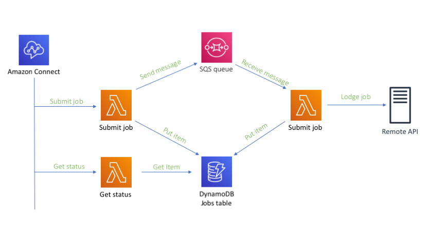

# Job Lodgement Pattern

Demonstrates how to deploy long running Lambda functions and call them from Connect, giving the customer a good experience.

It uses DynamoDB to store the state of requests.

## Architecture

The system deploys three Lambda functions:

## Submit Function

This function updates the status in DynamoDB then sends a message to SQS

## Lodge Function

This function reads messages from SQS and processes them, calling the remote API and updating the status in DynamoDB.

## Status function

This function can be used to poll for the status of the job from DynamoDB.
	